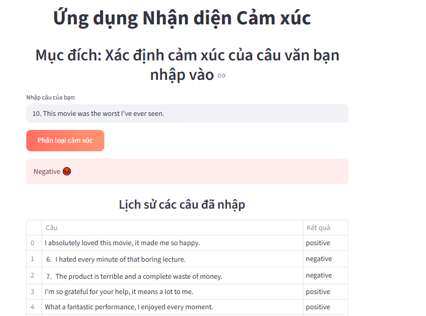

 🎭 Emotion Detection App

Ứng dụng nhận diện cảm xúc gồm **2 giai đoạn phát triển**:

- **Phase 1**: Nhận diện cảm xúc từ văn bản do người dùng nhập.  
- **Phase 2** *(đang phát triển)*: Nhận diện cảm xúc qua khuôn mặt từ ảnh hoặc camera.

---

###### ->>>>>>>> 📌 Tính năng hiện tại (Phase 1) <<<<<<<<-#######

- Giao diện trực quan với **Streamlit**.  
- Làm sạch và tiền xử lý văn bản (NLTK, stopwords, tokenization).  
- Vector hóa văn bản bằng **TF-IDF**.  
- Huấn luyện mô hình **Naive Bayes** để phân loại cảm xúc (`Positive`, `Negative`).  
✅ Hiển thị **biểu đồ màu sắc sinh động** trực tiếp trên web.  

---

## 🚀 Demo

![Demo Phase 1] 
*Ví dụ nhập văn bản và xem kết quả nhận diện cảm xúc.*

### Tích cực (Positive)
1.I absolutely loved this movie, it made me so happy.
2.What a fantastic performance, I enjoyed every moment.
3.The food was delicious and the service was excellent.
4.This is the best day of my life!
5.I’m so grateful for your help, it means a lot to me.

### Tiêu cực (Negative)
6.I hated every minute of that boring lecture.
7.The product is terrible and a complete waste of money.
8.I’m extremely disappointed with the poor quality.
9.The service was awful, I will never come back here.
10.This movie was the worst I’ve ever seen.
---

## 🛠️ Cài đặt và chạy

```bash
# 1. Clone project
git clone https://github.com/huynh-dang187/emotion-detector-app.git


# 2. Tạo môi trường ảo (khuyến nghị)
python -m venv venv
venv\Scripts\activate   # Windows
source venv/bin/activate  # Mac/Linux

# 3. Cài đặt thư viện
pip install -r requirements.txt

# 4. Chạy ứng dụng
streamlit run testStreamlit.py
