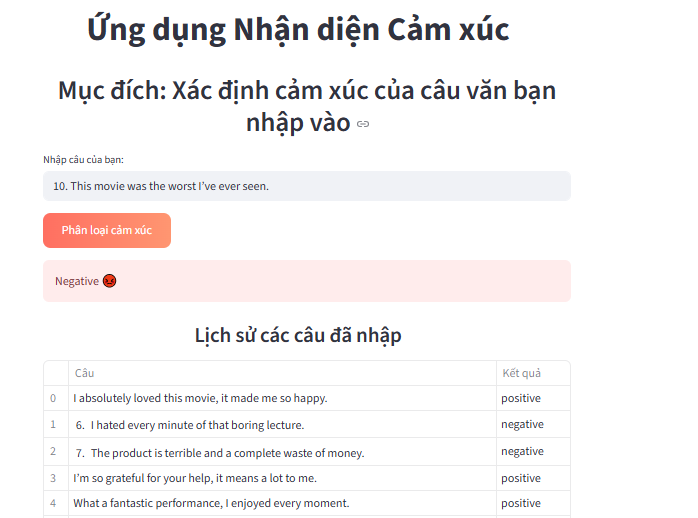

### Emotion Detection App

## Introduction 

Ứng dụng nhận diện cảm xúc gồm **2 giai đoạn phát triển**:

- **Phase 1**: Nhận diện cảm xúc từ văn bản do người dùng nhập.  
- **Phase 2**: Nhận diện cảm xúc qua khuôn mặt từ ảnh hoặc camera.

---

### Tính năng hiện tại (Phase 1) ###

- Giao diện trực quan với **Streamlit**.  
- Làm sạch và tiền xử lý văn bản (NLTK, stopwords, tokenization).  
- Vector hóa văn bản bằng **TF-IDF**.  
- Huấn luyện mô hình **Naive Bayes** để phân loại cảm xúc (`Positive`, `Negative`).  
- Hiển thị **biểu đồ màu sắc sinh động** trực tiếp trên web.  

## 🚀 Demo

![Demo Phase 1] 
*Ví dụ nhập văn bản và xem kết quả nhận diện cảm xúc.*

---

## 🛠️ Cài đặt và chạy

# 1. Clone project
git clone https://github.com/huynh-dang187/emotion-detector-app.git

# 2. Cài đặt thư viện
pip install -r requirements.txt

# 3. Chạy ứng dụng
streamlit run testStreamlit.py
